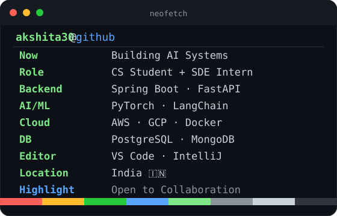

<h3>akshitap30</h3>

 

<!-- ============================================================
     HEATMAP — full width (matches portrait + info-card combined)
     ============================================================ -->

 
 

<!-- ============================================================
     PORTRAIT + INFO CARD — side by side via table
     (flex/grid via inline style is stripped by GitHub sanitizer)
     ============================================================ -->
<table>
<tr>
<td align="center" valign="top">

</td>
<td align="center" valign="top">

</td>
</tr>
</table>

 

